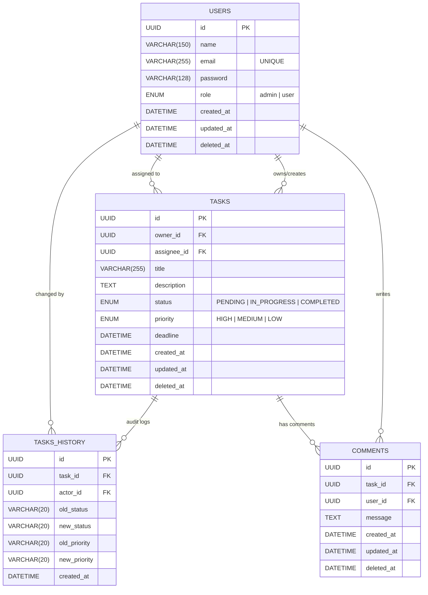

# Database Schema

# Data Models Overview

| Entity | Purpose |
|--------|----------|
| User | Auth, roles, ownership, assignment |
| Task | Core functional entity |
| TaskHistory | Track what changed & who changed it |
| Comments | Communication on tasks |

